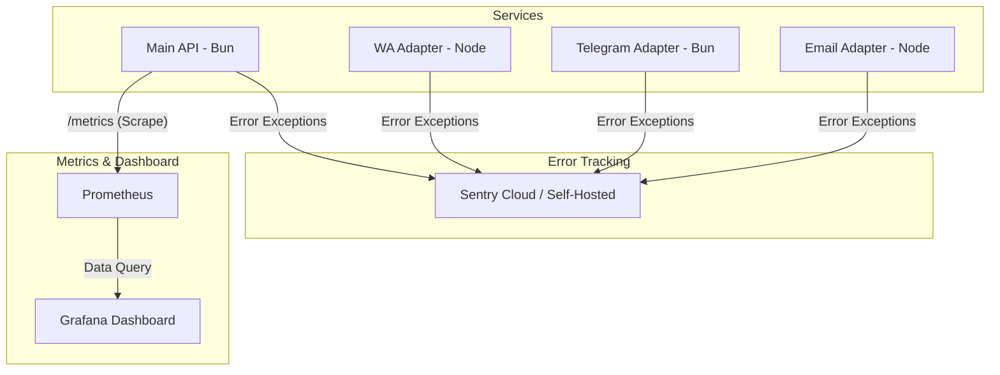

# Panduan Monitoring, Logging & Telemetry

Platform Omnichannel ini dilengkapi dengan sistem monitoring, telemetry, dan logging terintegrasi menggunakan **Sentry**, **Pino**, **Prometheus**, dan **Grafana** untuk memberikan visibilitas penuh terhadap kesehatan aplikasi di lingkungan produksi.

---

## 1. Arsitektur Monitoring



---

## 2. Pelacakan Error dengan Sentry

Sentry digunakan untuk merekam error, uncaught exceptions, dan unhandled promise rejections secara real-time di seluruh microservices.

### Konfigurasi Env
Setiap layanan akan otomatis mengaktifkan Sentry jika variabel lingkungan `SENTRY_DSN` tersedia:
```env
SENTRY_DSN=https://your-public-key@sentry.io/project-id
```

### Penanganan Global
- **Main API (Hono)**: Semua unhandled exception yang terjadi pada route handler akan ditangkap oleh middleware `app.onError` dan dilaporkan ke Sentry.
- **Adapters (WA, Telegram, Email)**: Pemicu global `unhandledRejection` dan `uncaughtException` dipasang pada objek `process` untuk memastikan tidak ada error fatal yang terlewat secara diam-diam.

---

## 3. Structured Logging dengan Pino

Logging berbasis teks biasa (`console.log`) diganti dengan **Structured Logging** menggunakan library **Pino** di seluruh layanan backend. Hal ini menghasilkan log format JSON yang mudah diparsing oleh log aggregator seperti Elasticsearch, Logstash, Loki, atau Fluentd.

### Contoh Output Log (JSON)
```json
{
  "level": 30,
  "time": "2026-06-09T15:40:29.123Z",
  "pid": 12,
  "hostname": "ocpf-main-api",
  "msg": "Request processed",
  "method": "GET",
  "path": "/api/conversations/105/messages",
  "status": 200
}
```

### Konfigurasi Tingkat Log (Log Level)
Anda dapat menyesuaikan sensitivitas log via variabel lingkungan `LOG_LEVEL` (default: `info`):
- `fatal`, `error`, `warn`, `info`, `debug`, `trace`, `silent`.

---

## 4. Metrik Sistem dengan Prometheus

Layanan **Main API** mengekspos metrik internal sistem di endpoint `/metrics` menggunakan library `prom-client`.

### Metrik yang Dikumpulkan:
1. **http_requests_total**: Counter untuk menghitung jumlah total HTTP request masuk, dikelompokkan berdasarkan label `method`, `path`, dan `status`.
2. **http_request_duration_seconds**: Histogram untuk mengukur latensi/durasi pemrosesan HTTP request dengan bucket interval presisi.
3. **Metrik Default Runtime (Node/Bun)**:
   - Penggunaan memory resident set (`process_resident_memory_bytes`).
   - Beban kerja CPU (`process_cpu_system_seconds_total`).
   - Aktivitas Garbage Collection dan Event Loop delay.

---

## 5. Visualisasi dengan Grafana Dashboard

Grafana digunakan untuk memvisualisasikan data metrik dari Prometheus ke dalam panel dashboard interaktif yang indah.

### Konfigurasi Otomatis (Provisioning)
Di dalam folder [monitoring/](file:///home/wardix/agy/ocpf-flash/monitoring), kami telah menyiapkan konfigurasi otomatis agar ketika Grafana dijalankan, ia akan langsung mengimpor:
- **Datasource**: Prometheus server local (`http://prometheus:9090`).
- **Dashboard**: Panel interaktif lengkap untuk HTTP request rate, p95 request latency, total requests, CPU load, dan memory usage.

---

## 6. Cara Menjalankan Monitoring Stack (Quickstart)

Monitoring stack sudah terintegrasi ke dalam file [docker-compose.yml](file:///home/wardix/agy/ocpf-flash/docker-compose.yml).

### A. Menjalankan di Local / Development
Cukup jalankan seluruh stack menggunakan Docker Compose:
```bash
docker compose up -d
```
Layanan akan berjalan pada port berikut:
- **Main API**: `http://localhost:8000`
- **Prometheus UI**: `http://localhost:9090`
- **Grafana UI**: `http://localhost:3000` (Kredensial default: Username `admin`, Password `admin`)

### B. Menjalankan di Production
Gunakan file override production untuk menyembunyikan port Prometheus dari internet:
```bash
docker compose -f docker-compose.yml -f docker-compose.prod.yml up -d
```
Di production, hanya **Grafana** (`port 3000`) dan **Main API / Frontend** yang diekspos ke publik untuk keamanan data metrik.
